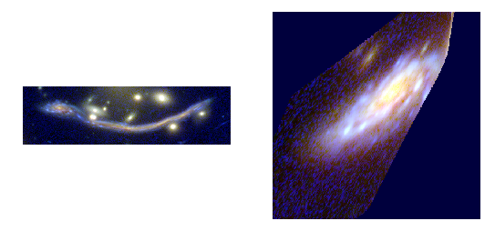

FRApy: Fitting Resolved Arcs with python
#########################################

FRApy is python code that fits gravitational arcs in image plane with analytical modes, such as metallicity gradients and velocity fields, taking into account the lensing distortions. This is done in a Bayesian framework, by maximising a log-logarithm likelihood function using an MCMC sampler (`emcee <http://dfm.io/emcee/current/>`_).

Intro
=================================

Gravitational arcs
--------------------

Gravitational arcs are galaxies in the backgroud of a cluster of galaxies or a massive galaxy. These massive objects act as a *magnifying lens*, increasing the size of the backgroud galaxies in the sky, which allows us to resolve them at smaller spatial scales. However, the magnification is not uniform, and the lensed galaxies appear 'distorted' in the sky, typically in an arc-like shape (hence the name graviational 'arcs').

   This is a gravitational arc called 'the dragon' lensed by the cluster Abell 370. On the left, you can see it in *image plane*, i.e. as it is in the sky, magnified it all its messy glory. On the right, we have use a lensing model to correct this magnification and get 'the real galaxy'. This is called the *source plane* image.

The spatial distortion makes the analysis of these objects more difficult, especially when several images of the same object (called multiple images) are available. FRApy deals with this issue through forward-modelling: we start with a model in source plane (the 'undistorted' galaxy), lens it to image plane using a lensing model and compare it with the data.

What you'll need
--------------------

1. Deflection maps. These are images produced from a lensing model that map how much deflection (in arcseconds) a little photon originated in position x,y in the sky will suffer due to the gravitational lens. This is the core of FRApy's modelling and allows us to generate lensed images that can be compared with the observations. We do this by calculating where each pixel in source plane will 'land' in image plane. A number of Frontier Fields models provide these maps, you can check them `here <https://archive.stsci.edu/pub/hlsp/frontier/abell370/models/>`_. It is also possible to create these maps using LENSTOOL using the `dpl <https://projets.lam.fr/projects/lenstool/wiki/RunMode#dpl-int1-int2-float-filename1-filename2>`_ command. 

2. An analytical model that you hope describes your data, such as a gradient for metallicity or an arctangent model velocity fields. FRApy comes with a number of these models,
that we used in our own publications, but we also show how you can create and fit your own model.

Install
=================================

>> pip install -i https://test.pypi.org/simple/ FRApy

The project is also available `GitHub <https://github.com/VeraPatricio/FRApy>`_.

It requires the following packages:

	- numpy==1.15.4
	- matplotlib==3.0.2
	- astropy==3.1
	- reproject==0.4 
	- emcee==2.2.1
	- pickle==4.0
	- corner==2.0.1

Quick start
-------------------------------

FRApy is a python module. A minimum working example would look something like this:

.. code-block:: python

	# Import FRApy
	from frapy import Observation,Metallicity_Gradient,Output
	from frapy import fit_model,make_input_parameters

	# Load Observations
	obs = Observation(z=0.611,
		          data_path='Demo_data/AS1063_map_metallicity.fits',
		          unc_path='Demo_data/AS1063_map_metallicity_unc.fits',
		          seeing = 1.03/0.2)

	# Choose a Model, in this case a linear metallicity gradient
	model = Metallicity_Gradient(zlens=0.322,
				     dfx_path='Demo_data/AS1063_dplx.fits',
				     dfy_path='Demo_data/AS1063_dply.fits')
	model.create_projection_maps(obs)

	# Fit the data
	input_par = make_input_parameters(name    = ('cx', 'cy',  'q', 'pa', 'z_grad', 'z_0'),
					  value   = (  29,   23,  0.7,   20,    -0.02, 9.0),
					  minimum = (  28,   22,  0.4,  -20,     -0.1, 8.5),
					  maximum = (  33,   27,  0.9,   90,      0.0, 9.5))
	out = fit_model(obs,model,input_par,'output_file',nsteps=2000,nwalkers=24)

	# Inspect the fit
	results = Output('output_file')
	results.best_parameters()

Mode in depth demos 
-------------------------------

We have included demo data used in Patricio et al. in prep. and two notebooks with examples on how to fit your data.

`Metallicity Gradient Example <https://github.com/VeraPatricio/FRApy/blob/master/examples/demo_fit_metallicity_gradient.ipynb>`_.

`Velocity Field Example <https://github.com/VeraPatricio/FRApy/blob/master/examples/demo_fit_velocity_model.ipynb>`_.

Authors and Citations
======================

This code was developed by:

* Vera Patricio (vera.patricio@dark-cosmology.dk), main contributer
* Johan Richard, lensing specialist

If you use FRApy in your science, please add the following citation:

`Patrício et. al, 2018 <https://ui.adsabs.harvard.edu/#abs/2018MNRAS.477...18P/abstract>`_.

and 

Patrício et. al, in prep.

and don't forget `astropy <http://www.astropy.org/>`_ and `emcee <http://dfm.io/emcee/current/>`_!	

Code Documentation 
=================================

.. toctree::
   :maxdepth: 2
   :caption: Contents:

Observations
-------------------------------
.. automodule:: frapy.observations
	:members:

Models
-------------------------------
.. automodule:: frapy.models
	:members:

Fitting
-------------------------------
.. automodule:: frapy.fit_model
	:members:

Explore the output
-------------------------------
.. automodule:: frapy.check_fit
	:members:

Miscelaneous
-------------------------------
.. automodule:: frapy.utils
	:members:

Indices and tables
==================

* :ref:`genindex`
* :ref:`modindex`
* :ref:`search`
